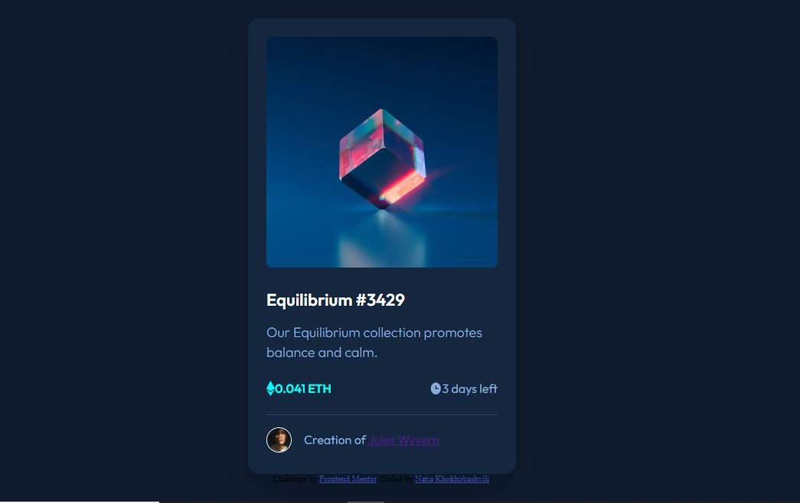
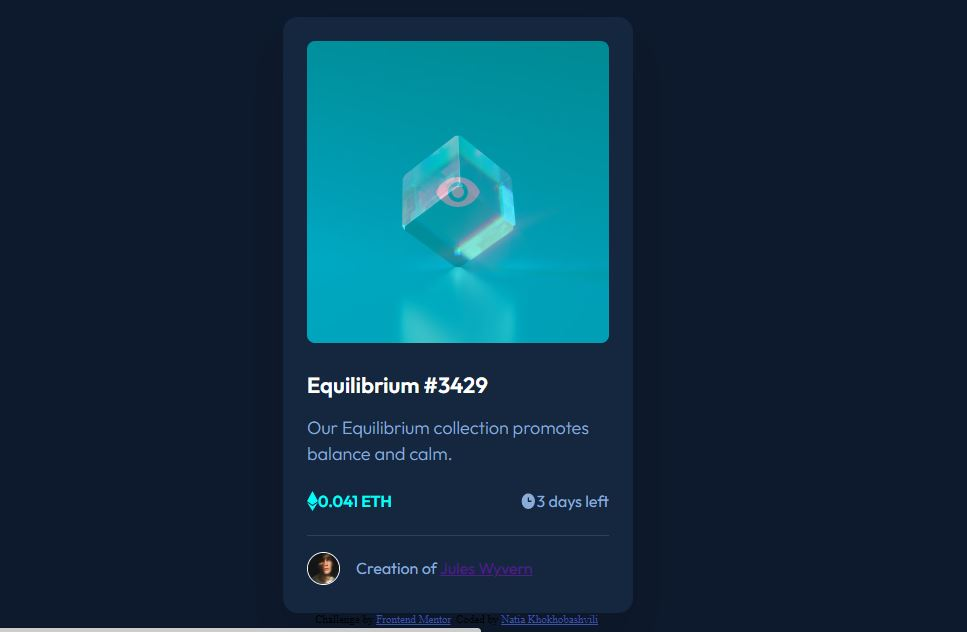

 NFT preview card component solution

## Table of contents

- [Overview](#overview)
  - [The challenge](#the-challenge)
  - [Screenshot](#screenshot)
  - [Links](#links)
- [My process](#my-process)
  - [Built with](#built-with)
  - [What I learned](#what-i-learned)
  - [Continued development](#continued-development)
  - [Useful resources](#useful-resources)
- [Author](#author)
- [Acknowledgments](#acknowledgments)

## Overview

### The challenge

Users should be able to:

- View the optimal layout depending on their device's screen size
- See hover states for interactive elements

### Screenshot

### Links

- Solution URL: [Add solution URL here](https://your-solution-url.com)
- Live Site URL: [Add live site URL here](https://your-live-site-url.com)

## My process

### Built with

- Semantic HTML5 markup
- CSS custom properties
- Flexbox

### What I learned

It was so difficult to use "Opacity" for me, and I need to study more about it, however I think that I learnt the basic part of it and could to do this chalange. In addition I learnt how to add two elements in one line on two different side. 

### Useful resources

- [Example resource 1](www.w3schools.com) - This helped me for XYZ reason. I really liked this pattern and will use it going forward.

## Author

- Linkedin - [Natia Khokhobashvili](https://www.linkedin.com/in/natia-khokhobashvili-4b960b1b2/)

